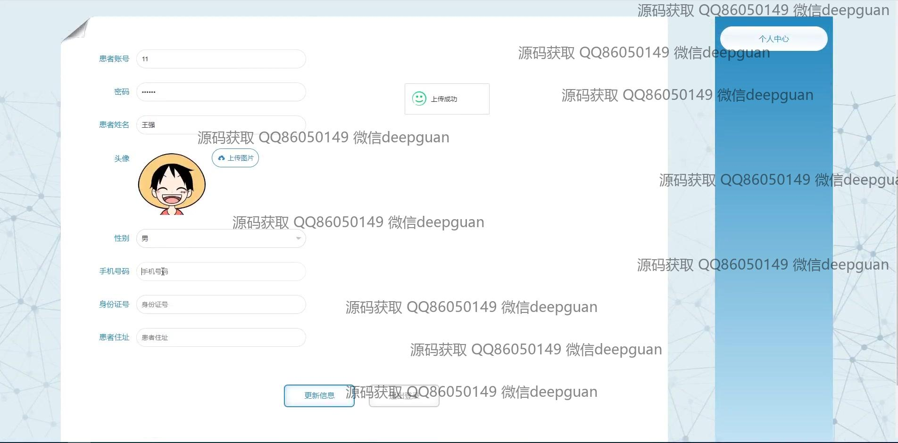
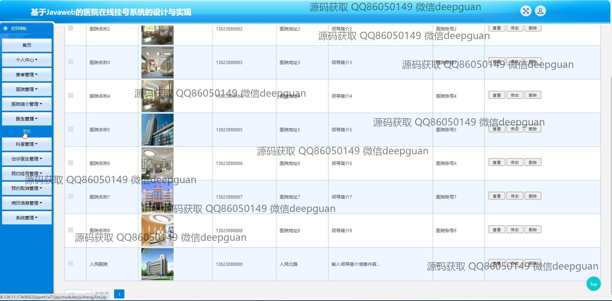

<h1 align="center">基于Javaweb的医院在线挂号系统的设计与实现</h1>

## 简介
医院在线挂号系统：支持管理员、医院、医生和患者角色，提供预约挂号、医生管理、医院信息管理、支付功能及公告编辑等模块，简洁高效，功能全面。    --计算机毕业设计源码；毕设源码；java毕业设计源码

## 联系方式

<h3 align="center">获取完整代码与数据库文件 + 微信：deepguan QQ: 86050149 QQ群: 783742310</h3>

<h3 align="center">可帮忙远程部署 包运行成功！提供远程部署、修改代码、设计文档指导、代码讲解等服务！</h3>

## 功能介绍（完整见运行截图）
管理员：基本功能包含登录、注册和退出，能够管理医院信息、编辑公告信息和医生信息，通过导航栏访问首页、个人中心、医院管理、医生管理、出诊医生管理、预约挂号管理、病历信息管理及系统后台。可以添加、修改或删除医院和医生的信息，审核患者的挂号请求，并处理相关支付事宜。用户：能够通过注册、登录访问系统，进入个人中心查看或修改个人信息，查询医院和医生信息，进行预约挂号和查询预约状态，使用多种支付方式完成挂号费用的支付，并查看挂号历史。提升注册和支付的使用便利性。医生：医生通过注册或登录进入系统，能够查看和编辑个人信息及出诊安排，通过系统管理预约信息。医生角色可以访问医生管理，查询病历管理，及处理来自患者的预约请求，确保出诊安排准备就绪。患者：可以在系统内注册并登录，填写个人信息后开始进行医院科室的预约，浏览医疗设备和技术信息，查看医院简介及公告。挂号后，患者可以选择支付宝、微信等支付平台完成挂号支付，通过系统个人中心管理和查看自己的医疗预约和病历记录。

## 运行截图

本代码来源于网络,仅供学习参考使用!

